# Vocabulary Booster

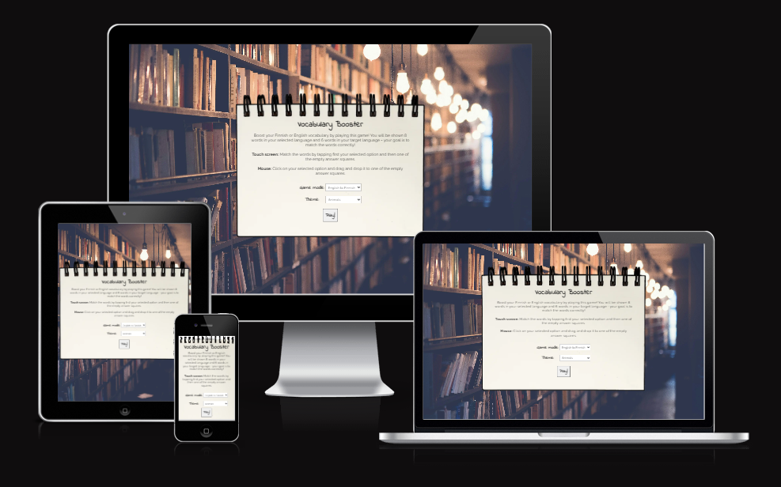

Vocabulary Booster is an online language-learning game that allows users to improve their Finnish and English vocabulary by playing a fun game.

The purpose of this project is to help those who are learning Finnish or English to increase their vocabulary and encourage others to take up language learning by offering fun, easy and engaging way to start learning a new language.

The deployed project can be found here: [Vocabulary Booster](https://jonnlai.github.io/language-game/)

## Table of Content

1. [User Experience (UX)](#user-experience-ux)
2. [Features](#features)
3. [Technologies Used](#technologies-used)
4. [Testing](#testing)
5. [Deployment](#deployment)
6. [Finished Product](#finished-product)
7. [Credits](#credits)
8. [Features not implemented](#features-not-implemented)

## User Experience (UX)

### Business Goals

- The website promotes language learning by providing an easy way to start learning a new language.
- The website allows its users to boost their vocabulary.

### User stories

- As a new language learner, I want an easy way to improve my vocabulary.
- As a language learner, I want a fun and engaging way to learn.
- As someone who has been learning their target language for some time already, I want to be able to challenge myself.

### Colour Palette

The colour palette was created using the [Coolors](https://coolors.co/) colour palette generator. The first two colours (blue and wheat) are being used as the background colour of the squares that hold the words in different languages. Black is being used throughout the page for fonts and borders and the last colour (#CFC3BB) is being used for buttons when they are being hovered over.

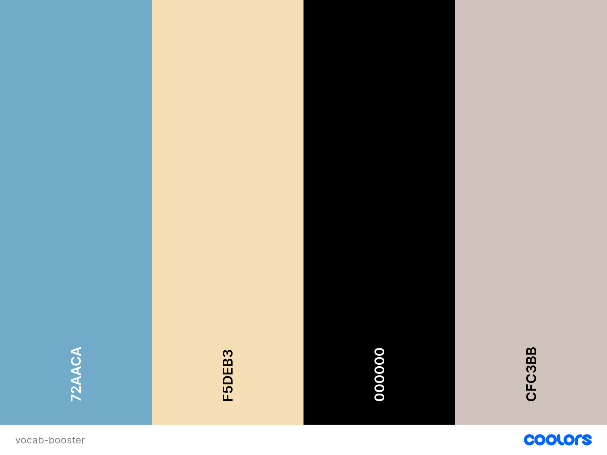

### Typography

The main font used is Raleway, with sans serif as the fallback font. Indie Flower was used for the main heading (h1), buttons and labels, with cursive as the fallback. Indie Flower was used to give some elements of the page a hand-written feel.

### Wireframe

[Balsamiq](https://balsamiq.com/) User Interface wireframing tool was used to design the structure of the website.

| Feature             | Mobile                                                   |
| ------------------- | -------------------------------------------------------- |
| Drag and Drop       | 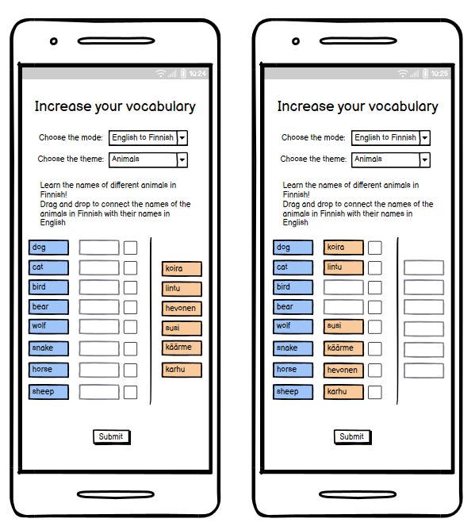   |
| All answers correct | 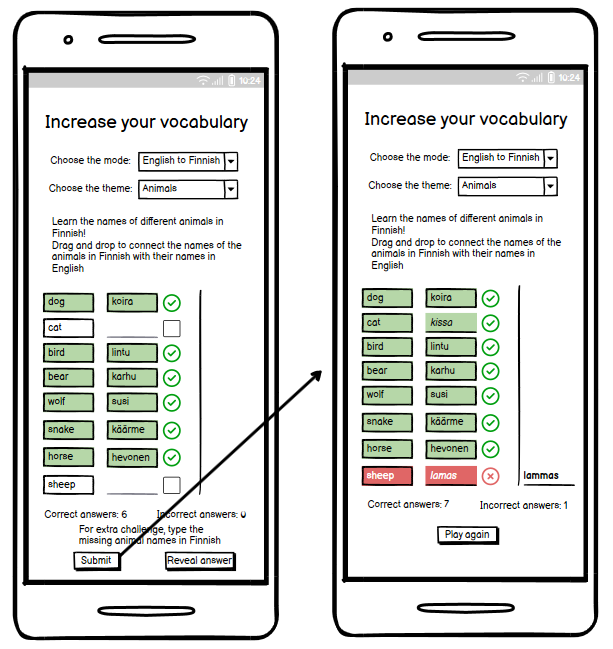 |
| Reveal answer       | 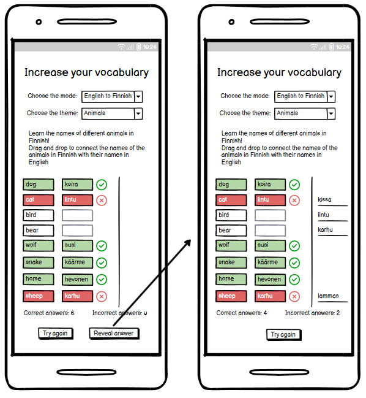   |

[Back to top](#vocabulary-booster)

## Features

### General

- The project was developed using a "mobile first" development approach to ensure good User Experience for those using mobile phones and other smaller devices.
- The site is fully responsive across all device sizes.
- Consistent style, including colours and fonts, was used across all the pages.

### Favicon

- The Favicon is an emoji of three books piled on top of one another to represent learning and studying.

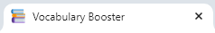

### Notebook background

The game and the instructions are displayed on a background image that looks like a notebook page. There are two versions of the notebook image: a longer and narrower image for mobile devices and a wider image for larger screens.

| Mobile                                                                  | Desktop                                                       |
| ----------------------------------------------------------------------- | ------------------------------------------------------------- |
| 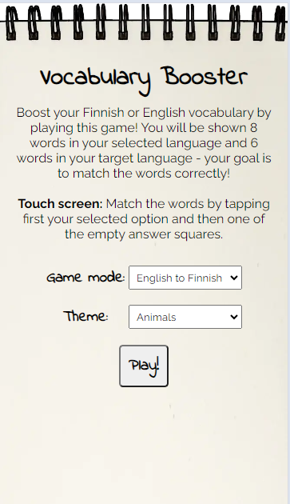 | 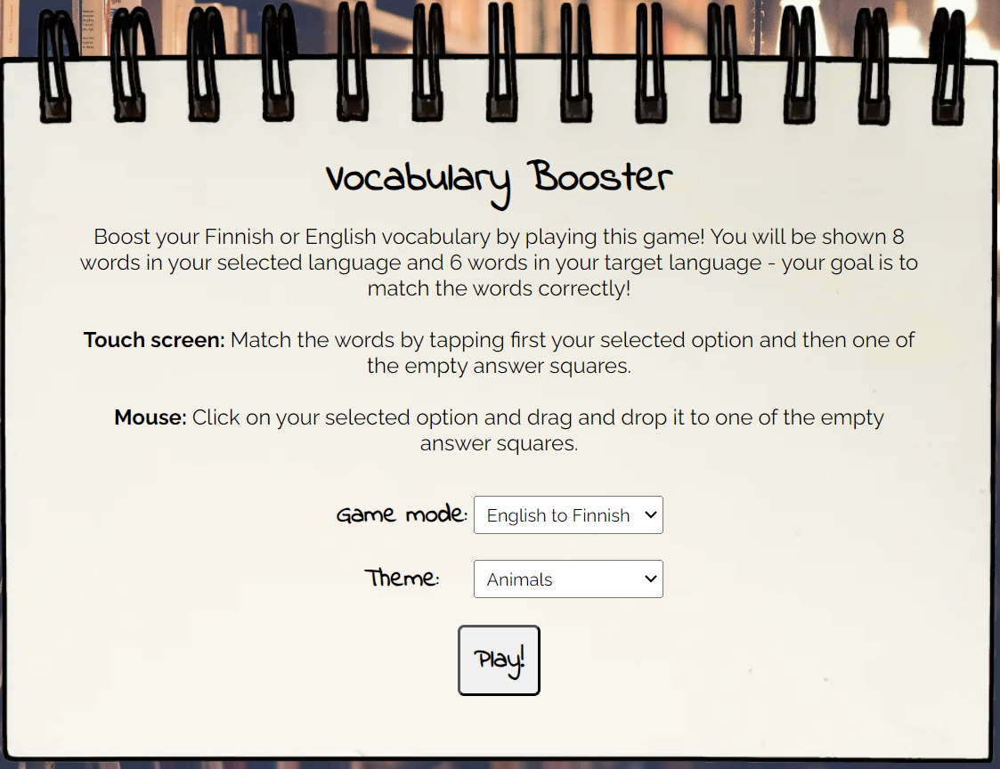 |

### Body background

When the game is being played using a tablet or a larger device, an image of bookshelves in a dimly lit room is displayed in the background. Together with the notebook image, this gives the user a sense of relaxed and fun but high-quality study experience.

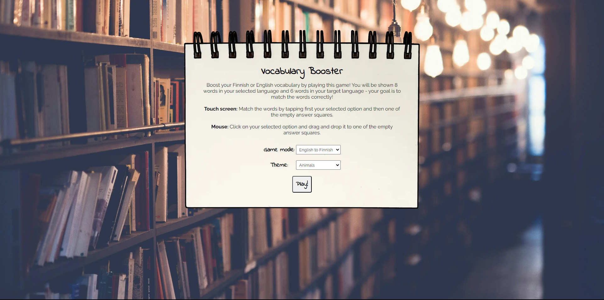

### Heading

The heading tells the user the name of the game and it is shown on top of the "notebook page" throughout the game. A cursive font, Indie Flower, is being used to give a hand-written feel, as if someone had handwritten the game on the notebook.

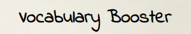

### Instructions

The instructions on how to play the game are displayed when the page loads. The goal of the game is explained clearly as well as how to play using either a touch screen device or a mouse. When using a smaller device (<750px), instructions on how to play using a mouse are hidden to save space on smaller screens. When using a screen larger than 750px, all the instructions are displayed in case the user is using a larger touch screen device rather than a desktop or laptop with a mouse.

| Mobile                                                                | Desktop                                                 |
| --------------------------------------------------------------------- | ------------------------------------------------------- |
| 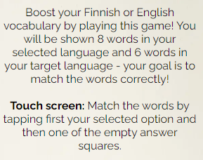 | 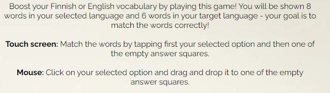 |

### Select the game

The player chooses the mode (i.e. the language combination) and the theme using the two dropdown menus. After they have made their selection, the player clicks "Play" to start the game.

| Selection area                                                                        | Select language                                        | Select theme                                      |
| ------------------------------------------------------------------------------------- | ------------------------------------------------------ | ------------------------------------------------- |
| 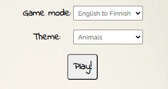 | 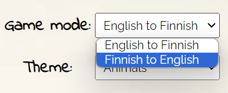 | 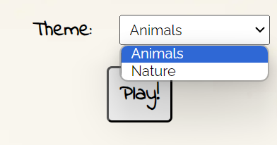 |

### Buttons

When hovered over, the buttons change colour to a darker shade to give the user feedback and indicate that they can be clicked.

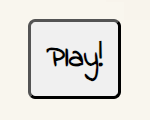 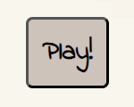

### Game

The eight words that need to be translated are displayed on the left on a blue background. The six translated words are displayed on the right on a wheat-coloured background. The "dropzones", the areas where the player needs to place the translated words, have dashed borders.

| Game English - Finnish                         | Game Finnish - English                                 |
| ---------------------------------------------- | ------------------------------------------------------ |
| 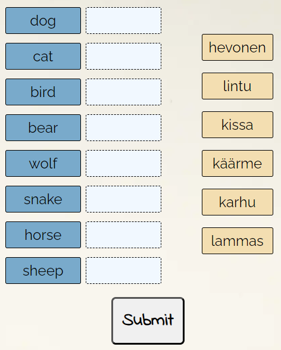 | 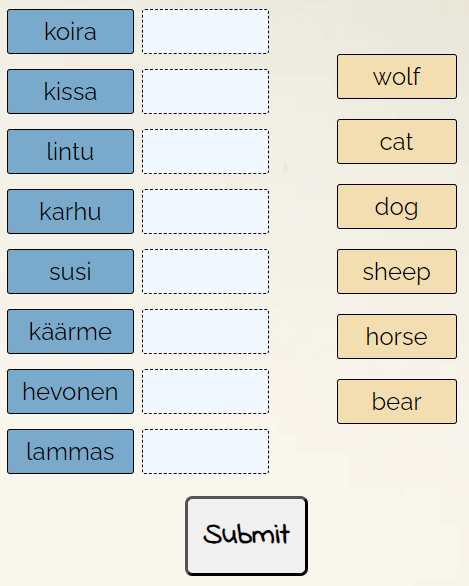 |

The six answers are selected randomly from the eight options and are displayed in a random order to challenge the player each time they play.

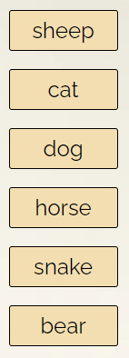 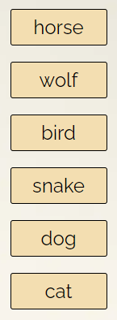 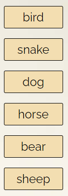

If the player is using a touch screen device such as a mobile phone, first they tap the option they want to select and then they tap the square where they want the word to go. If they are using a mouse, they need to drag and drop the options to the correct blank squares.

| Touch screen                                                      | Mouse                                                         |
| ----------------------------------------------------------------- | ------------------------------------------------------------- |
| 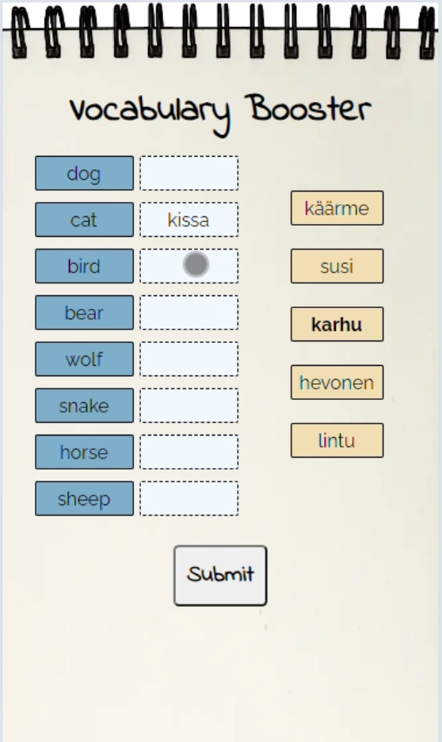 | 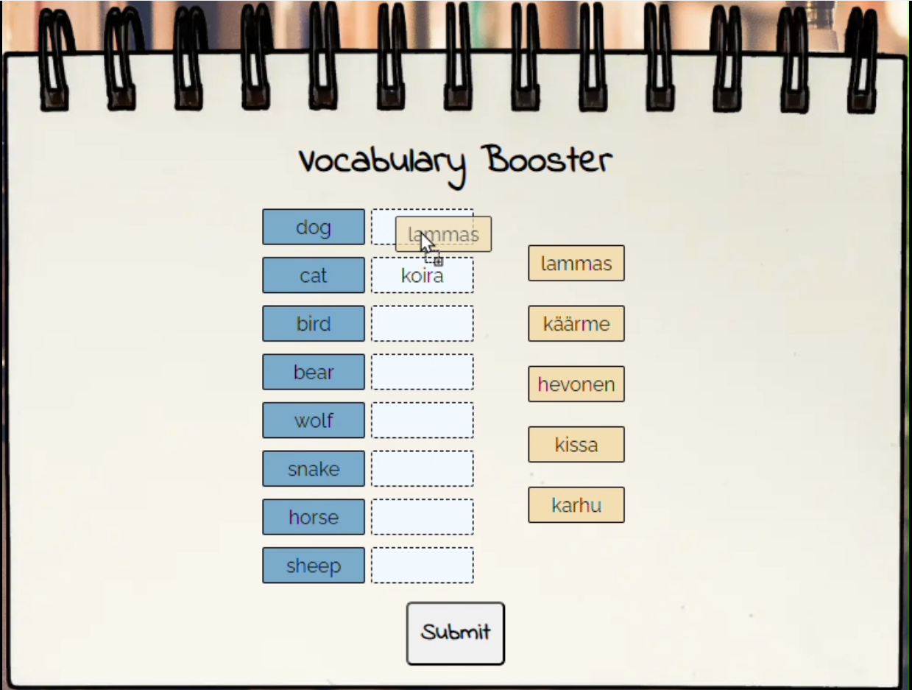 |

### Check the answer

When the player clicks "Submit", the answers they have given are checked. All the correct answers are indicated by giving the answers green background colour and adding a green tick next to the answer. Incorrect correct answer are indicated by red background colour and a red x next to the word.

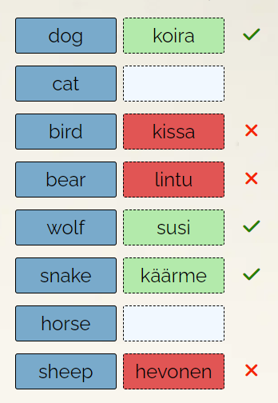

The correct and incorrect answers are counted, and the player is shown a message to either congratulate them for getting all the answers correct or to encourage them to continue practising. Clicking "Play Again" reloads the page taking the player back to the initial screen.

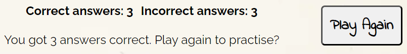 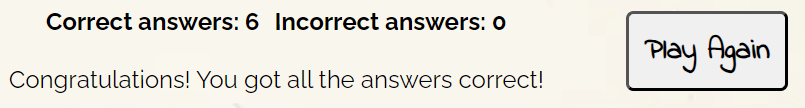

[Back to top](#vocabulary-booster)

## Technologies Used

### Languages Used

- [HTML5](https://html.com/html5/)
- [CSS3](https://www.w3.org/Style/CSS/)
- [Javascript](https://developer.mozilla.org/en-US/docs/Learn/JavaScript/First_steps/What_is_JavaScript)

### Frameworks, Libraries and Programmes Used

- [Balsamiq](https://balsamiq.com/) was used for designing the project and creating wireframes to communicate the vision.
- [VSCode](https://code.visualstudio.com/) was used for writing, committing, and pushing code to GitHub.
- [GitHub](https://github.com/) was used for storing the project.
- [Google Fonts](https://fonts.google.com/) was used to import the selected fonts.
- [Font Awesome](https://fontawesome.com/) was used to add icons to the site to give the user a visual representation of incorrect and correct answers.
- [Chrome DevTools](https://developer.chrome.com/docs/devtools) were used regularly throughout the development of the project to test and troubleshoot.
- [Pixelied](https://pixelied.com/convert/) was used to convert the images to webp format.
- [TinyPNG](https://tinypng.com/) was used to optimise the images by reducing their size.
- [Favicon.io](https://favicon.io/) was used to create the Favicon.
- [Responsive Design Checker](https://www.responsivedesignchecker.com/) was used to check the site's responsiveness on different devices.
- [Am I responsive?](https://ui.dev/amiresponsive) was used to create the mockup image of the landing page on different devices.

[Back to top](#vocabulary-booster)

## Testing

### User Stories Testing

1. As a new language learner, I want an easy way to improve my vocabulary.

   - The game allows the user to choose whether they want to translate from Finnish or English, and lets the user to practise as long as needed.

2. As a language learner, I want a fun and engaging way to learn.

   - The game is easy to navigate and use, and it has a fun but professional feel to it.

3. As someone who has been learning their target language for some time already, I want to be able to challenge myself.
   - The game lets the user select different themes so that they can challenge themselves and continue expanding their vocabulary.

### Code Validation

- The [W3C Markup Validator](https://validator.w3.org/), [W3C CSS Validator](https://jigsaw.w3.org/css-validator/) and [JSHint](https://jshint.com/) were used to validate the code to ensure that the project meets the current Web Standards and is free from any unintended syntax errors and mistakes that could cause issues with accessibility and usability.

- W3C Markup Validator:

  - highlighted that the form element's action attribute was empty. The action attribute was removed to resolve this issue as the form is not being used to send data.
  - highlighted several times that the trailing slash on void elements had no effect. However, these were not removed as they had been added by Prettier when the code had been formatted.
    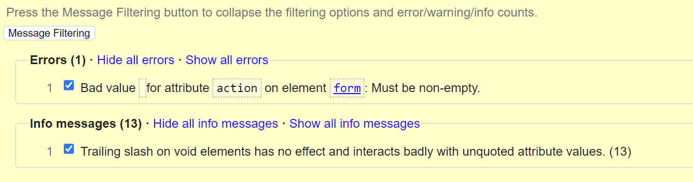

- W3C CSS Validator highlighted no issues.
  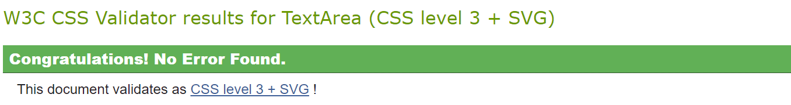

- JSHint:

  - highlighted that the "b" variable had not been defined. This was fixed by adding the "let" keyword to declare the variable. (The variable name was later changed to "i" to improve the naming of variables.)

  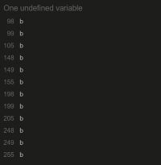

  - highlighted that "loadGame" was unused. However, this function is being called from index.html and therefore, this warning was ignored.
  - gave the warnings below. These don't impact the current functionality of the page so these warnings were ignored.

  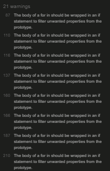 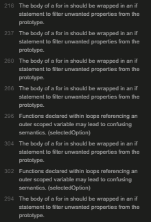 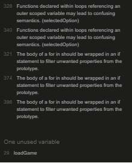

### Manual Testing

#### Browser compatibility

The website was tested on the following browsers:

- Google Chrome - no issues identified.
- Mozilla Firefox - The Game Mode label was displayed over two lines. The label length was increased by 5px to resolve this issue.
- Microsoft Edge - no issues identified.
- Samsung Internet (tablet) - no issues identified.

#### Device compatibility

The website was tested on the following devices:

- Sony Xperia 10 III - no issues identified.
- Samsung Galaxy A52s - no issues identified.
- Lenovo Yoga s730 - no issues identified.
- Sony VAIO 15" - no issues identified.
- Dell P2419H 24" screen - no issues identified.
- Samsung Galaxy Tab S4 - no issues identified.

#### Common Elements Testing

- **Dropdown menus:** Dropdown menus work correctly allowing the user to choose their desired language combination and theme.
- **Play button:** When clicked or tapped, the play button starts the game correctly by displaying the selected game.
- **Drag and Drop:** When using a mouse, the drag and drop function works correctly allowing an option to be selected, dragged to the desired dropzone and dropped there. The function allows the position of an option to be changed if needed.
- **Tap to select an option:** When using a touch screen device, an option can be selected by tapping it. The selected option's font-weight becomes bold to indicate that it has been selected.
- **Tap to drop an option:** When using a touch screen device, the selected option can be "dropped" by tapping the desired dropzone. The option's font-weight returns to normal. The option can be selected and moved again if needed.
- **Submit button:** The Submit button checks the answer and displays correct answers in green and incorrect ones in red. The number of correct answers is hidden when using a device wider than 350px or longer than 600px.
- **Play Again button:** The Play Again button is displayed correctly after the Submit button has been clicked. Clicking the button reloads the page starting the game again.

### Performance and Accessibility

Chrome DevTool Lighthouse was used to assess the project's performance and accessibility. The reports confirmed that the page performs well and is accessible.

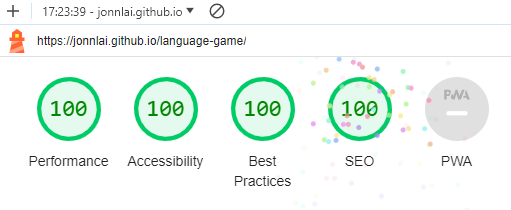
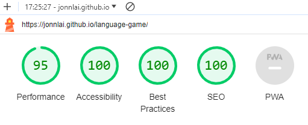

### Responsiveness

In addition to manual checks, responsiveness was tested further using [Chrome DevTools](https://developer.chrome.com/docs/devtools) and [Responsive Design Checker](https://www.responsivedesignchecker.com/). Media query was added to make the page more responsive by reducing the amount of content and spacing when using a short (<600px) and narrow (<350px) device. This means the users of those devices don't need to scroll when playing the play but can display the whole game on their screen. No other issues were identified.

During the development process, a warning message about a non-passive event listener was noted. The event handler was made passive to improve responsiveness as suggested.
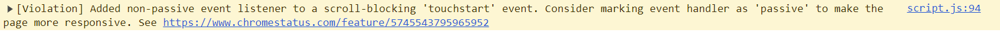

### Solved Bugs

- A script src attribute had been incorrectly typed as "scr" which meant that the Javascript was not correctly linked. This was fixed early on.
- Inside playGame() function, the dropZones variable was a NodeList and therefore, an error message was received when for...in loop was being used to iterate through it. The dropZones variable was converted to array resolve this issue.
- After the drag and drop functionality was added, the game only worked when using a mouse. The developer tried to solve this issue by adding "touch action: none" to the draggable elements ([GitHub](https://github.com/taye/interact.js/issues/564)). However, this did not solve the problem. Therefore, it was decided that it was best to add "touchstart" event listeners to allow playing by tapping the selected option and dropzone. ([Web Dev Simplified- Learn Javascript Touch Events in 17 Minutes](https://www.youtube.com/watch?v=TaPdgj8mucI))
- Two options could be dropped in the same dropZone causing an error. This was solved adding an if statement to check whether the target element has a childNode already and if so, return without appending the selected option.
- When using a touch screen device, it was possible to select one of the dropZone squares before selecting an option. This resulted in selectedOption being given the value of "undefined" and that being appended to the tapped dropZone square resulting in an error. This was solved by adding an if statement to check whether selectedOption has the value of undefined and if so return without appending the selected option.
- Favicon did not display correctly because the file path was incorrect. This was solved by assets/favicon to file path.
- The answers count was taking up space before being displayed impacting the ability to center element correctly. This was solved by changing its display property to none in CSS until the checkAnswer() function is being called.
- After submitting the answer, it was possible to move the options again. This was solved for when a mouse is being used by changing the draggable attribute's value to false after the Submit button has been clicked.

### Unsolved Bugs

- It is still possible to move the options after submitting the answer when using a touch screen device. This does not impact the final score and therefore, this issue is not being considered critical and has been left unsolved but it would be beneficial to resolve this in the future.

[Back to top](#vocabulary-booster)

## Deployment

This project was developed using VSCode, and the project was deployed to GitHub pages. The project was deployed in the early stages of the development process to allow the developer to test the site on different devices and identify and fix any issues.

### GitHub pages

The project was deployed to GitHub pages by taking the following steps:

1. Log into **GitHub** and locate your GitHub repo.
2. Open the **Settings** tab of your GitHub repo.
3. Locate the **Code and automation** section on the side menu, and select **Pages**.
4. Under **Build and Deployment**,
   1. set **Source** to Deploy from Branch,
   2. set **Branch** to Main Branch,
   3. set **Folder** to / (root) and
   4. click **Save**.
5. Open the **Code** tab and refresh your page after a couple of minutes.
6. Under **Deployment**, select 'github-pages' and click the link under **Active Deployments**.

[Back to top](#vocabulary-booster)

## Finished Product

### Game Introduction

| Mobile                                                          | Desktop                                                           |
| --------------------------------------------------------------- | ----------------------------------------------------------------- |
| 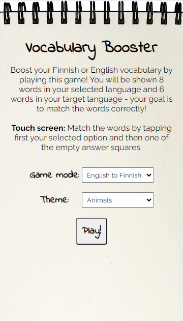 |  |

### Game Page

| Mobile                                                               | Desktop                                                                |
| -------------------------------------------------------------------- | ---------------------------------------------------------------------- |
| 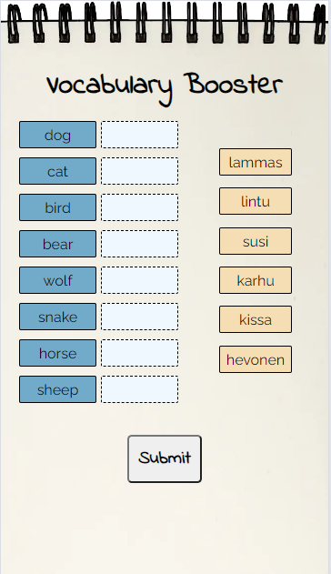 | 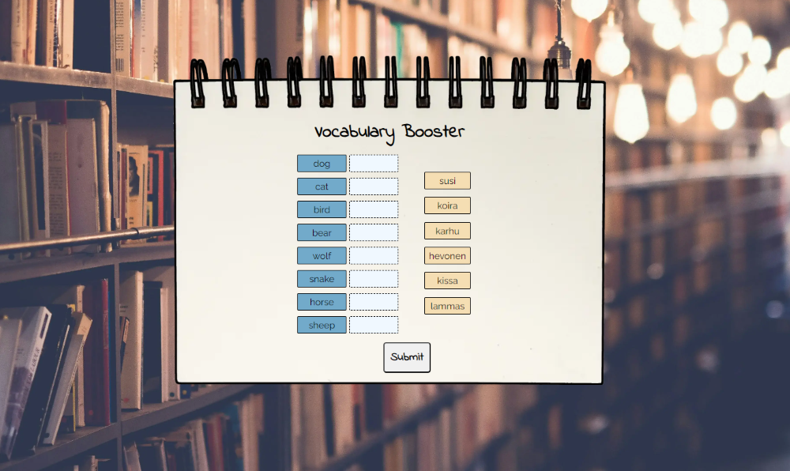 |

### Playing the game

| Mobile                                                                        | Desktop                                                                   |
| ----------------------------------------------------------------------------- | ------------------------------------------------------------------------- |
| 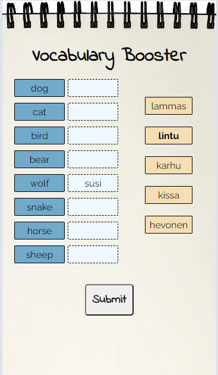 | 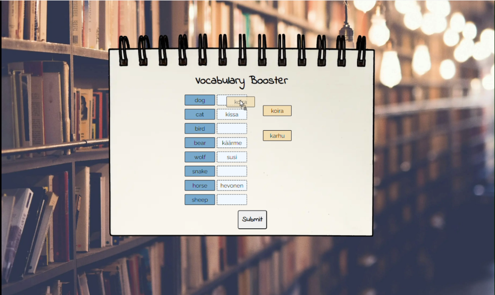 |

### Checking the answer

| Mobile                                                                       | Desktop                                                                        |
| ---------------------------------------------------------------------------- | ------------------------------------------------------------------------------ |
| 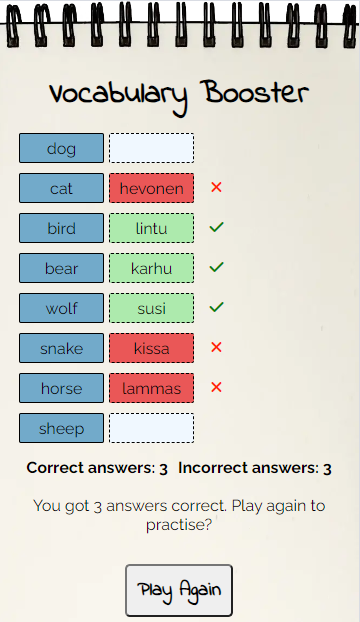 | 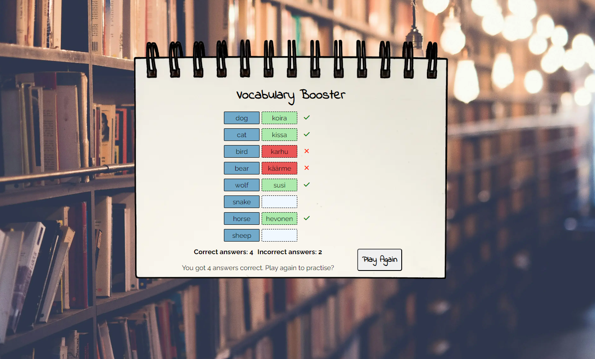 |

[Back to top](#vocabulary-booster)

## Credits

### Content

All the content was written by the developer.

### Media

#### Images

- The notebook background: A photo by [Kamran Aydinov](https://www.freepik.com/free-photo/top-view-open-notepad_17020858.htm#query=notebook%20background&position=8&from_view=keyword&track=ais&uuid=7587716c-ed8d-47e3-9fe9-b9e3795a024b) on [Freepik](https://www.freepik.com/)
  - Modified by the developer's partner to remove the background and to create a longer and narrower version of the image. (As permitted by Freepik's free license terms)
- The library background: Image by [StockSnap](https://pixabay.com/users/stocksnap-894430/?utm_source=link-attribution&utm_medium=referral&utm_campaign=image&utm_content=2596809) from [Pixabay](https://pixabay.com//?utm_source=link-attribution&utm_medium=referral&utm_campaign=image&utm_content=2596809)

#### Icons

- All icons other than Favicon are from [Font Awesome](https://fontawesome.com/).

#### Favicon

- This favicon was generated using the following graphics from Twitter Twemoji:

  - Graphics Title: 1f4da.svg
  - Graphics Author: [Copyright 2020 Twitter, Inc and other contributors](https://github.com/twitter/twemoji)
  - Graphics Source: [Graphics Source](https://github.com/twitter/twemoji/blob/master/assets/svg/1f4da.svg)
  - Graphics License: [CC-BY 4.0](https://creativecommons.org/licenses/by/4.0/)

### Code

- The idea to use a for loop to create a grid and how to use drag and drop event listeners were taken from [Slide-Puzzle](https://github.com/ImKennyYip/slide-puzzle/blob/master/puzzle.js)
- The following resources were also consulted to create the drag and drop event listeners:
  - [MDN Web Docs](https://developer.mozilla.org/en-US/docs/Web/API/HTMLElement/drag_event)
  - [Darwin Tech JavaScript Drag and Drop Youtube tutorial](https://www.youtube.com/watch?v=_G8G1OrEOrI)
- The following resources were consulted to create the touch events:

  - [Web Dev Simplified- Learn Javascript Touch Events in 17 Minutes](https://www.youtube.com/watch?v=TaPdgj8mucI)
  - [MDN Web Docs](https://developer.mozilla.org/en-US/docs/Web/API/Touch_events)

- [W3Schools](https://www.w3schools.com/), [Stack Overflow](https://stackoverflow.com/) and [MDN Web Docs](https://developer.mozilla.org/en-US/) were regularly consulted for ideas and to ensure understanding.

[Back to top](#vocabulary-booster)

## Features not implemented

The following features were considered during the development of this project, but it has not been possible to implement them yet.

- **Display answer function** A function to display the correct answers after the user has submitted their answers if they did not get all of them correct.
- **Challenge function** A function to allow the user to write the translations of the two missing words as an extra challenge if they have matched all the six words correctly.
- **Level 2 game** Instead of matching two words, this game requires the player to write the translation of each word without any prompts.
- **Help pop-up** A button that allows the user to open the instructions as a pop-up window while they have the game open if they need to review the instructions again.
