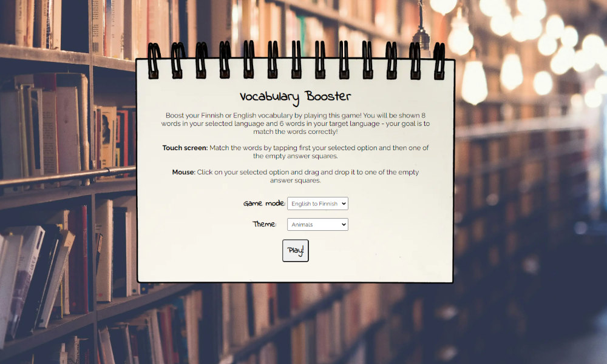
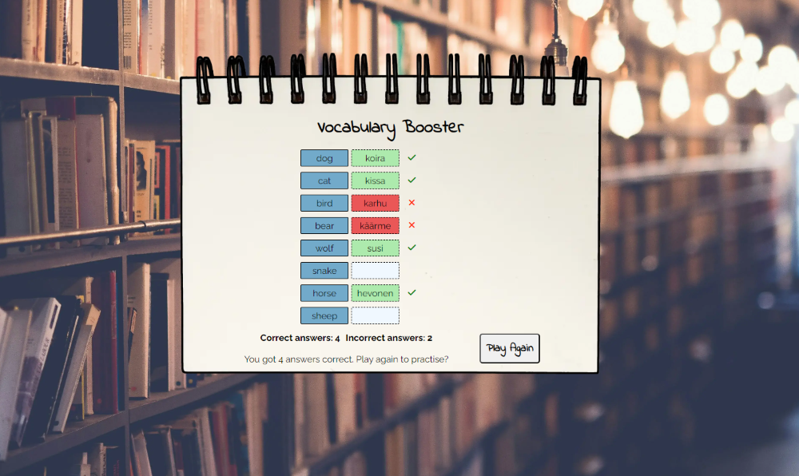

# Vocabulary Booster

Vocabulary Booster is an online language learning game that allows users to improve their Finnish and English vocabulary by playing a fun game.

The purpose of this project is to help those who are learning Finnish or English to increase their vocabulary and encourage others to take up language learning by offering fun, easy and engaging way to start learning a new language.

The deployed project can be found here: [Vocabulary Booster](https://jonnlai.github.io/language-game/)

## User Experience (UX)

### Business Goals

- The website promotes language learning by providing an easy way to start learning a new language.
- The website allows its users to boost their vocabulary.

### User stories

- As a new language learner, I want an easy way to improve my vocabulary.
- As a language learner, I want a fun and engaging way to learn.
- As someone who has been learning their target language for some time already, I want to be able to challenge myself.

### Colour Palette

The colour palette was created using the [Coolors](https://coolors.co/) colour palette generator. The first two colours (blue and wheat) are being used as the background colour of the squares that hold the words in different languages. Black is being used throughout the page for fonts and borders and last colour (#CFC3BB) is being used for buttons when they are being hovered over.

### Typography

The main font used is Raleway, with sans serif as the fallback font. Indie Flower was used for the main heading (h1), buttons and labels, with cursive as the fallback. Indie Flower was used to give some elements of the page a hand-written feel.

### Wireframe

[Balsamiq](https://balsamiq.com/) User Interface wireframing tool was used to design the structure of the website.

| Feature             | Mobile                                                   |
| ------------------- | -------------------------------------------------------- |
| Drag and Drop       |    |
| All answers correct |  |
| Reveal answer       |    |

[Back to top](#vocabulary-booster)

## Features

### General

- The project was developed using a "mobile first" development approach to ensure good User Experience for those using mobile phones and other smaller devices.
- The site is fully responsive across all device sizes.
- Consistant style, including colours and fonts, were used across all the pages.

### Favicon

- The Favicon is an emoji of three books piled on top of another to represent learning and studying.

### Notebook background

The game and the instructions are displayed on a background image that looks like a notebook page. There are two versions of the notebook image: longer and narrower image for mobile devices and a wider images for larger screens.

| Mobile                                                                  | Desktop                                                       |
| ----------------------------------------------------------------------- | ------------------------------------------------------------- |
|  |  |

### Body background

When the game is being played using a tablet or a larger device, an image of book shelves in a dimly lit room is being displayed in the background. Together with the notebook image this gives the user a sense of relaxed and fun but high-quality study experience.

### Heading

The heading gives the user the name of the game and is being dislayed on top of the "notebook page" throughout the game. A cursive font, Indie Flower, is being used to give a hand-written feel, as if someone had handwritten the game on the notebook.

### Instructions

The instructions on how to play the game are displayed when the page loads. The goal of the game is explained clearly as well as how to play using either a touch screen device or a mouse. When using a smaller device (<750px) instructions on how to play using a mouse are hidden to save space on smaller screens. When using a screen larger than 750px, all the instructions are displayed in case the user is larger touch screen device.

| Mobile                                                                | Desktop                                                 |
| --------------------------------------------------------------------- | ------------------------------------------------------- |
|  |  |

### Select the game

The player chooses the mode (i.e. the language combination) and the theme using the two dropdown menus. After they have made their selection, the player clicks "Play" to start the game.

| Selection area                                                                        | Select language                                        | Select theme                                      |
| ------------------------------------------------------------------------------------- | ------------------------------------------------------ | ------------------------------------------------- |
|  |  |  |

### Buttons

When hovered over, the buttons change colour to a darker shade to give the user feedback and indicate that they can be clicked.

 

### Game

The eight words that need to be translated are displayed on the left on blue background. The six translated words are displayed on the right on wheat-coloured background. The "dropzones", the areas where the player needs to place the translated words, have dashed borders.

| Game English - Finnish                         | Game Finnish - English                                 |
| ---------------------------------------------- | ------------------------------------------------------ |
|  |  |

The six answers are selected randomly from the eight options and are being displayed in a random order to challenge the player each time they play.

  

If the player is using a touch screen device such as a mobile phone, first they tap the option they want to select and then they tap the square where they want the word to go. If they are using a mouse, they need to drag and drop the options to the correct blank squares.

| Touch screen                                                                                    | Mouse                                                                                           |
| ----------------------------------------------------------------------------------------------- | ----------------------------------------------------------------------------------------------- |
| <video controls src="readme-files/features/play-mobile.mp4" title="Play demo - mobile"></video> | <video controls src="readme-files/features/play-desktop.mp4" title="Play demo desktop"></video> |

### Check the answer

When the player clicks "Submit", the answers they have given are checked. All the correct answers are indicated by giving the answers green background colour and adding a green tick next to the answer. Incorrect correct answer are indicated by red backgroud colour and a red x next to the word.

The correct and incorrect answers are counted and the player given a message to either congratulate them for getting all the answers correct or to encourage them to continue practising. Clicking "Play Again" reload the page taking the player back to the initial screen.

 

[Back to top](#vocabulary-booster)

## Technologies Used

### Languages Used

- [HTML5](https://html.com/html5/)
- [CSS3](https://www.w3.org/Style/CSS/)

### Frameworks, Libraries and Programmes Used

- [Balsamiq](https://balsamiq.com/) was used for designing the project and creating wireframes to communicate the vision.
- [VSCode](https://code.visualstudio.com/) was used for writing, committing, and pushing code to GitHub.
- [GitHub](https://github.com/) was used for storing the project.
- [Google Fonts](https://fonts.google.com/) was used to import the selected fonts.
- [Font Awesome](https://fontawesome.com/) was used to add icons to the site to give the user a visual representation of incorrect and correct answers.
- [Chrome DevTools](https://developer.chrome.com/docs/devtools) were used regularly throughout the development of the project to test and troubleshoot.
- [Pixelied](https://pixelied.com/convert/) was used to convert the images to webp format.
- [TinyPNG](https://tinypng.com/) was used to optimise the images by reducing their size.
- [Favicon.io](https://favicon.io/) was used to create the Favicon.
- [Responsive Design Checker](https://www.responsivedesignchecker.com/) was used to check the site's responsiveness on different devices.
- [Am I responsive?](https://ui.dev/amiresponsive) was used to create the mockup image of the landing page on different devices.

[Back to top](#vocabulary-booster)

## Deployment

This project was developed using VSCode, and the project was deployed to GitHub pages. The project was deployed in the early stages of the development process to allow the developer to test the site on different devices and identify and fix any issues.

### GitHub pages

The project was deployed to GitHub pages by taking the following steps:

1. Log into **GitHub** and locate your GitHub repo.
2. Open the **Settings** tab of your GitHub repo.
3. Locate the **Code and automation** section on the side menu, and select **Pages**.
4. Under **Build and Deployment**,
   1. set **Source** to Deploy from Branch,
   2. set **Branch** to Main Branch,
   3. set **Folder** to / (root) and
   4. click **Save**.
5. Open the **Code** tab and refresh your page after a couple of minutes.
6. Under **Deployment**, select 'github-pages' and click the link under **Active Deployments**.

[Back to top](#vocabulary-booster)

## Finished Product

### Game Introduction

| Mobile                                                          | Desktop                                                           |
| --------------------------------------------------------------- | ----------------------------------------------------------------- |
|  |  |

### Game Page

| Mobile                                                               | Desktop                                                                |
| -------------------------------------------------------------------- | ---------------------------------------------------------------------- |
|  |  |

### Playing the game

| Mobile                                                                   | Desktop                                                                                               |
| ------------------------------------------------------------------------ | ----------------------------------------------------------------------------------------------------- |
|  | <video controls src="readme-files/finished-product/drag-and-drop.mp4" title="Demo-drag-drop"></video> |

### Checking the answer

| Mobile                                                                       | Desktop                                                                        |
| ---------------------------------------------------------------------------- | ------------------------------------------------------------------------------ |
|  |  |

[def]: https://coolors.co/
